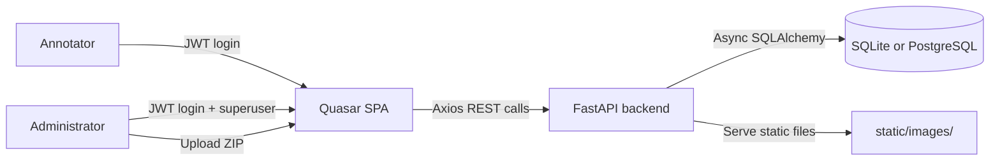
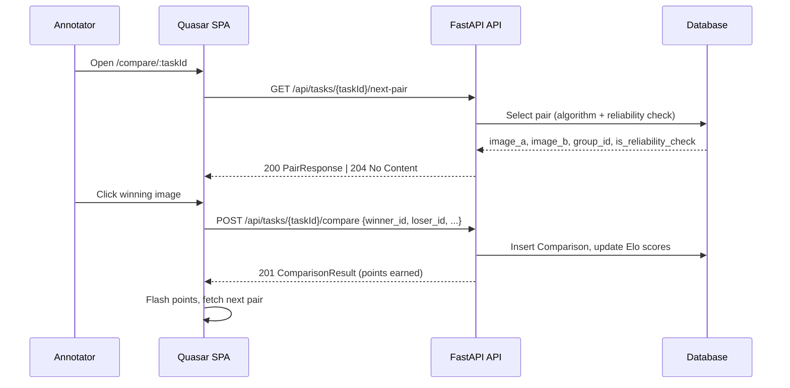
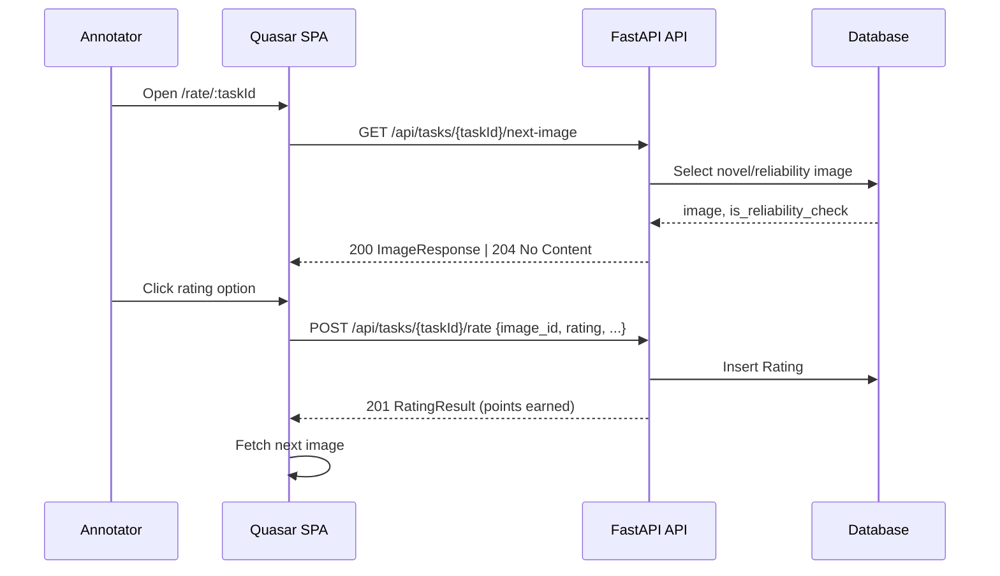
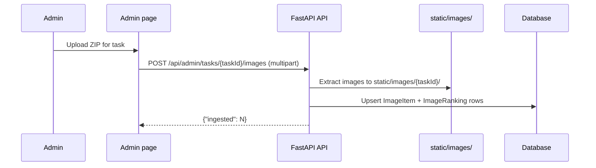

# image_rater Architecture

This application collects human image-quality annotations for benchmarking AI image-quality metrics.  Annotators log in, see available tasks, and label images one by one (either pairwise comparisons or single ratings).

## System context

## Backend responsibilities

- Authentication and user management use `fastapi-users` with JWT bearer tokens (UUID user IDs).
- Task definitions are stored in the database; each task has a type (`two_forced_choice` or `single_rating`) and configuration such as pair-selection algorithm, rating options, bonus multiplier, and reliability re-check ratio.
- Image upload accepts a ZIP archive; images are extracted to `static/images/{task_id}/`, and each image is assigned a group ID derived from its filename (see [Image Selection](image_selection.md)).
- For 2FC tasks, pair selection supports three algorithms (`least_seen`, `swiss`, `bradley_terry`); Elo scores are updated after each comparison.
- For single-rating tasks, images are served in random novel order with occasional reliability re-shows.
- A background reliability job computes per-user consistency and inter-rater agreement, which feed into the leaderboard score.

## Frontend responsibilities

- After login, users are directed to the **Task Selection** page (`/tasks`), which shows available tasks as cards.
- Selecting a 2FC task navigates to `/compare/:taskId`; selecting a rating task navigates to `/rate/:taskId`.
- The **Comparison page** shows two images side by side; the user clicks an image or presses ←/→ to choose the winner.  Points are flashed on each submission.
- The **Rating page** shows a single image with configurable option buttons (with optional keyboard hotkeys).
- The **Leaderboard page** shows the user's own stats, a weekly/all-time top-annotators table, global per-task statistics, and per-task leaderboards.
- The **Admin page** has five tabs: Tasks (CRUD), Images (browse / suspend), Rankings (Elo scores), Comparisons/Ratings (paginated history), and Reliability (per-user scores + recompute trigger).

## Annotation flow — 2FC

## Annotation flow — Single rating

## Image ingestion flow

## Key modules

| Module | Purpose |
|---|---|
| `config.py` | Pydantic settings from environment variables |
| `database.py` | Async SQLAlchemy engine, `User` ORM, `DBError` |
| `db_model.py` | ORM models: `Task`, `ImageItem`, `ImageRanking`, `Comparison`, `Rating`, `UserReliability` |
| `base_objects.py` | Pydantic v2 request/response schemas |
| `image_store.py` | ZIP extraction, group-ID parsing, image upsert |
| `pair_selector.py` | Three pair-selection algorithms + reliability re-shows |
| `image_selector.py` | Novel-image + reliability re-show selection for rating tasks |
| `scoring.py` | `compute_points()`, `update_elo()` |
| `reliability.py` | Background job: consistency + inter-rater agreement |
| `crud.py` | All database access functions |
| `routes.py` | FastAPI routers (`api_route`, `admin_route`) |
| `users.py` | fastapi-users configuration |
| `main.py` | App factory, middleware, lifespan |

## Further reading

- [Image Selection and Pair-Selection Algorithms](image_selection.md)
- [API Reference](api_reference.md)
- [Admin Guide](admin_guide.md)
